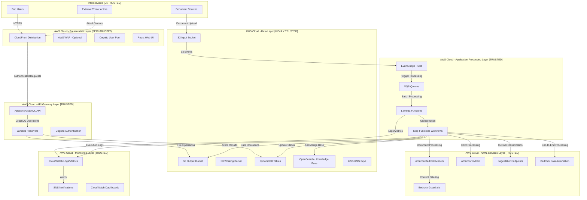
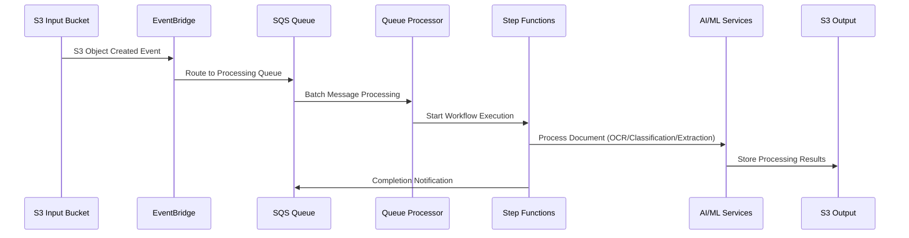

# GenAI IDP Accelerator - System Architecture Overview

**📖 Navigation:** [🏠 Main README](../README.md) | [📋 Executive Summary](../deliverables/executive-summary.md) | **🏗️ You are here** | [⚖️ Risk Assessment](../risk-assessment/risk-matrix.md) | [🛠️ Implementation Guide](../deliverables/implementation-guide.md)

---

## Executive Summary
The GenAI IDP Accelerator is a sophisticated serverless document processing platform that combines multiple AWS services to provide intelligent document processing capabilities. The system operates across multiple security zones with complex data flows and AI/ML integrations, presenting a rich attack surface that requires comprehensive threat analysis.

## Security Tenets

The GenAI IDP Accelerator is built around the following core security tenets:

### 1. **Data Protection First**
Customer document data is never exposed beyond the processing pipeline and is never used for model training or improvement. All customer data remains under customer control with comprehensive encryption and access controls.

### 2. **AI Model Security** 
All AI model interactions are protected by comprehensive content safety guardrails. No AI model can be manipulated to bypass security controls or extract unauthorized data through prompt injection or adversarial techniques.

### 3. **Zero Trust Processing**
No implicit trust exists between processing stages. Every input, output, and intermediate result is validated, sanitized, and verified. Each processing component operates with minimal required privileges.

### 4. **Compliance by Design**
The system architecture inherently supports regulatory compliance (GDPR, HIPAA, SOX) with built-in data classification, audit trails, encryption, and privacy controls that cannot be bypassed.

### 5. **Transparent Processing**
Complete audit trails exist for all document processing activities. Every processing decision, AI model interaction, and data transformation is logged and traceable for security analysis and compliance verification.

### 6. **Resilient Security**
Security controls are designed to fail securely. If any security component fails, the system defaults to blocking processing rather than allowing potentially unsafe operations to proceed.

## Security Anti-Patterns Analysis

The following AWS Security Anti-Patterns were evaluated for relevance to the GenAI IDP system:

### 1. **Overprivileged IAM Roles** - ⚠️ RELEVANT
**Anti-Pattern**: IAM roles with more permissions than required for functionality
**Threat Mapping**: 
- **STRIDE-LAMBDA-E**: Lambda privilege escalation through overprivileged execution roles
- **SAC.2**: Cross-function privilege escalation chain
- **P3.T03**: Cross-service privilege escalation

**Mitigation Strategy**: 
- Implement least privilege IAM policies with regular access reviews
- Use IAM permissions boundaries for additional protection
- Deploy automated privilege analysis and right-sizing

### 2. **Unencrypted Data Storage** - ⚠️ RELEVANT  
**Anti-Pattern**: Storing sensitive data without encryption at rest
**Threat Mapping**:
- **STRIDE-S3-I**: S3 bucket information disclosure
- **DF.1**: Data in transit interception
- **STRIDE-DDB-I**: DynamoDB unauthorized access

**Mitigation Strategy**:
- Customer-managed KMS encryption for all sensitive data stores
- Encryption in transit with TLS 1.2+ for all communications
- Regular encryption compliance audits

### 3. **Weak Authentication & Authorization** - ⚠️ RELEVANT
**Anti-Pattern**: Insufficient authentication controls or weak authorization logic
**Threat Mapping**:
- **STRIDE-COG-T**: Cognito token manipulation
- **STRIDE-AS-T**: AppSync query injection and authorization bypass
- **Authentication bypass**: JWT token manipulation attacks

**Mitigation Strategy**:
- Multi-factor authentication for all administrative access
- Strong password policies and token expiration controls
- Field-level authorization in GraphQL APIs

### 4. **Insufficient Input Validation** - ⚠️ HIGHLY RELEVANT
**Anti-Pattern**: Accepting and processing untrusted input without validation
**Threat Mapping**:
- **AME.1**: Coordinated multi-model prompt injection attack
- **P2.T01**: Multi-stage prompt injection chain  
- **DAP.1**: Polyglot document persistence attack

**Mitigation Strategy**:
- Comprehensive input validation at every processing stage
- Document content sanitization and malware detection
- AI model guardrails for prompt injection prevention

### 5. **Inadequate Logging & Monitoring** - ⚠️ RELEVANT
**Anti-Pattern**: Insufficient visibility into system behavior and security events
**Threat Mapping**:
- Delayed detection of **AME.1** prompt injection attacks
- **DF.6**: Logging information disclosure through overly verbose logs
- Reduced ability to detect **P1.T01** configuration poisoning

**Mitigation Strategy**:
- Comprehensive security event logging across all components
- Real-time anomaly detection and alerting
- Centralized log aggregation with tamper-evident storage

### 6. **Hardcoded Secrets** - ✅ NOT APPLICABLE
**Anti-Pattern**: Embedding secrets directly in code or configuration
**Assessment**: System uses AWS IAM roles and managed services - no hardcoded secrets identified

### 7. **Public Resources with Sensitive Data** - ⚠️ RELEVANT
**Anti-Pattern**: Making resources publicly accessible that contain sensitive information
**Threat Mapping**:
- **STRIDE-S3-I**: S3 bucket information disclosure through public access
- **CloudFront origin exposure**: Direct access bypassing CloudFront protections

**Mitigation Strategy**:
- Block all public access to S3 buckets containing sensitive data
- Use Origin Access Identity for CloudFront to S3 communication
- Regular resource access reviews and automated compliance checking

### 8. **Insufficient Network Segmentation** - ⚠️ PARTIALLY RELEVANT
**Anti-Pattern**: Flat network architecture without proper isolation
**Threat Mapping**:
- **P3.T03**: Cross-service privilege escalation through network access
- Lateral movement risks in **SAC.1** distributed state manipulation

**Mitigation Strategy**:
- VPC isolation for SageMaker endpoints (Pattern 3)
- Network ACLs and security groups for additional layers
- Consider VPC endpoints for sensitive AWS service communication

## APIs

The GenAI IDP system exposes the following APIs for document processing and management:

| API | Method | Status | Mutating or non-mutating | Functionality | Callable | Authorized | Comments |
|-----|--------|--------|--------------------------|---------------|----------|------------|----------|
| **uploadDocument** | POST | Active | Mutating | Generates presigned S3 URL for document upload | Web UI | Authenticated users | Internet via CloudFront |
| **getDocumentStatus** | GET | Active | Non-mutating | Retrieves processing status for uploaded document | Web UI | Document owner | GraphQL query |
| **listDocuments** | GET | Active | Non-mutating | Lists user's documents with processing status | Web UI | Document owner | GraphQL query |
| **getProcessingResults** | GET | Active | Non-mutating | Retrieves processed document results | Web UI | Document owner | GraphQL query via presigned URL |
| **updateConfiguration** | PUT | Active | Mutating | Updates processing configuration parameters | Web UI | Admin users | GraphQL mutation |
| **startProcessing** | POST | Active | Mutating | Manually triggers document processing workflow | Internal | Queue processor Lambda | Internal SQS trigger |
| **getWorkflowStatus** | GET | Active | Non-mutating | Retrieves Step Functions execution status | Internal | Tracking Lambda | Internal service call |
| **updateWorkflowStatus** | PUT | Active | Mutating | Updates document processing status in DynamoDB | Internal | Processing Lambdas | Internal service call |
| **invokeModel** | POST | Active | Non-mutating | Invokes Bedrock models for classification/extraction | Internal | Processing Lambdas | Internal service call |
| **invokeTextract** | POST | Active | Non-mutating | Processes documents through Amazon Textract | Internal | OCR Lambda | Internal service call |
| **invokeSageMakerEndpoint** | POST | Active | Non-mutating | Invokes UDOP model for document classification | Internal | Classification Lambda (Pattern 3) | Internal VPC call |
| **queryKnowledgeBase** | POST | Active | Non-mutating | Semantic search across processed documents | Web UI | Authenticated users | Optional feature |
| **submitBDAJob** | POST | Active | Non-mutating | Submits document to Bedrock Data Automation | Internal | BDA Lambda (Pattern 1) | Internal service call |

### API Security Controls
- **Authentication**: All external APIs require Cognito JWT tokens
- **Authorization**: Field-level authorization based on user roles and document ownership
- **Input Validation**: All APIs implement comprehensive input validation and sanitization
- **Rate Limiting**: GraphQL APIs protected by query complexity analysis and rate limiting
- **Audit Logging**: All API calls logged with user context and request/response details

> **📖 Quick Navigation:**
> - 🏗️ **[Architecture Diagrams](#high-level-architecture)**
> - 🔒 **[Security Zones & Trust Boundaries](#security-zones--trust-boundaries)**
> - ⚙️ **[Core Components](#core-components-analysis)**
> - 🗂️ **[Data Classification](#data-classification--sensitivity)**
> - 🛡️ **[Security Assessment](#architecture-security-assessment)**

> **🔗 Pattern-Specific Architecture:**
> - [🤖 Pattern 1: BDA](pattern-1-bda.md) - Bedrock Data Automation architecture
> - [⚡ Pattern 2: Textract + Bedrock](pattern-2-textract-bedrock.md) - Multi-stage AI processing
> - [🔄 Pattern 3: Textract + SageMaker + Bedrock](pattern-3-textract-sagemaker-bedrock.md) - Full ML pipeline
> - [🌊 Data Flows](data-flows.md) - Comprehensive data flow security analysis

> **🔗 Related Analysis:**
> - [🎯 STRIDE Analysis](../threat-analysis/stride-analysis.md) - Component-level threats
> - [🔍 Pattern-Specific Threats](../threat-analysis/pattern-specific-threats.md) - Processing vulnerabilities
> - [🤖 AI-Generated Threats](../threat-analysis/threat-designer-results/ai-generated-threats.md) - Novel attack vectors

## High-Level Architecture

### Security Zones & Trust Boundaries



## Core Components Analysis

### 1. Presentation Layer Components

#### CloudFront Distribution
- **Purpose**: Global content delivery for React web UI
- **Security Features**: HTTPS enforcement, custom security headers
- **Trust Level**: Semi-trusted (exposed to internet)
- **Key Vulnerabilities**: Cache poisoning, origin exposure, header bypass

#### AWS WAF (Optional)
- **Purpose**: Web application firewall protection
- **Security Features**: Request filtering, rate limiting, geo-blocking
- **Trust Level**: Security control (when deployed)
- **Key Vulnerabilities**: Rule bypass, false positives, configuration errors

#### Cognito User Pool
- **Purpose**: User authentication and authorization
- **Security Features**: Password policies, MFA, JWT tokens
- **Trust Level**: Trusted authentication boundary
- **Key Vulnerabilities**: Token manipulation, password attacks, account enumeration

### 2. API Layer Components

#### AppSync GraphQL API
- **Purpose**: Backend API for web UI interactions
- **Security Features**: Cognito integration, field-level authorization
- **Trust Level**: Trusted (authenticated access)
- **Key Vulnerabilities**: Query complexity attacks, schema introspection, injection

#### Lambda Resolvers
- **Purpose**: Backend business logic for API operations
- **Security Features**: IAM role isolation, VPC isolation (optional)
- **Trust Level**: Trusted
- **Key Vulnerabilities**: Code injection, privilege escalation, resource exhaustion

### 3. Processing Layer Components

#### Event-Driven Processing Flow


#### Key Processing Components:
- **EventBridge**: Event routing and filtering
- **SQS Queues**: Message buffering and throttling control
- **Lambda Functions**: Stateless processing units
- **Step Functions**: Workflow orchestration with error handling

### 4. AI/ML Services Layer

#### Amazon Bedrock
- **Models Used**: Claude, Nova, custom fine-tuned models
- **Operations**: Text classification, data extraction, summarization
- **Security**: Guardrails integration, content filtering
- **Threats**: Prompt injection, model evasion, token exhaustion

#### Amazon Textract
- **Operations**: OCR processing, form extraction, table detection
- **Input Sources**: PDF, PNG, JPG documents from S3
- **Threats**: Malicious document processing, OCR evasion

#### SageMaker Endpoints (Pattern 3)
- **Models**: UDOP for document classification
- **Deployment**: Real-time inference endpoints
- **Threats**: Model poisoning, endpoint exploitation, resource exhaustion

#### Bedrock Data Automation (Pattern 1)
- **Capabilities**: End-to-end document processing workflows
- **Integration**: S3 input/output, custom processing logic
- **Threats**: Workflow manipulation, quota exhaustion, data leakage

### 5. Data Layer Components

#### S3 Buckets
- **Input Bucket**: Receives uploaded documents
- **Output Bucket**: Stores processing results and UI assets
- **Working Bucket**: Temporary processing artifacts
- **Security**: Encryption at rest, access logging, bucket policies
- **Threats**: Unauthorized access, data exfiltration, bucket enumeration

#### DynamoDB Tables
- **Execution Tracking**: Document processing status
- **Configuration**: System and user configurations
- **Concurrency Control**: Workflow throttling management
- **Security**: Encryption at rest, fine-grained access control
- **Threats**: Injection attacks, unauthorized data access, performance attacks

#### OpenSearch (Knowledge Base)
- **Purpose**: Document semantic search and querying
- **Integration**: Bedrock Knowledge Base service
- **Security**: VPC isolation, encryption, access control
- **Threats**: Search injection, data exposure, performance attacks

## Data Classification & Sensitivity

### High Sensitivity Data
- **Customer Documents**: Input documents may contain PII, financial data, medical records
- **Extracted Data**: Structured data extracted from documents
- **User Credentials**: Authentication tokens, session data
- **AI Model Prompts**: Proprietary processing logic and prompts

### Medium Sensitivity Data
- **Processing Metadata**: Document processing statistics and logs
- **Configuration Data**: System settings, processing parameters
- **Performance Metrics**: System utilization and performance data

### Low Sensitivity Data
- **Public UI Assets**: Static web content, CSS, JavaScript
- **System Status**: General health and availability information
- **Documentation**: User guides and help content

## Network Architecture & Data Flows

### Primary Data Flows

1. **Document Upload Flow**
   ```
   User → CloudFront → S3 Input Bucket → EventBridge → SQS → Processing
   ```

2. **Authentication Flow**
   ```
   User → CloudFront → Cognito → AppSync → Lambda Resolvers → Backend Systems
   ```

3. **Processing Flow (Pattern 2 Example)**
   ```
   S3 Input → Textract (OCR) → Bedrock (Classification) → Bedrock (Extraction) → S3 Output
   ```

4. **Monitoring Flow**
   ```
   All Services → CloudWatch → SNS → Admin Notifications
   ```

### Trust Boundaries

1. **Internet ↔ AWS Cloud**: Primary security perimeter
2. **Presentation ↔ API Layer**: Authentication boundary
3. **API ↔ Processing Layer**: Authorization boundary  
4. **Processing ↔ Data Layer**: Data access boundary
5. **AI/ML Services**: Model security boundary

## Deployment Patterns

### Single-Region Deployment
- All components deployed in single AWS region
- Lower complexity, reduced cross-region data transfer costs
- Limited disaster recovery capabilities

### Multi-Region Considerations
- Cross-region replication for critical data
- Regional AI/ML service availability variations
- Compliance and data residency requirements

## Security Architecture Principles

### Defense in Depth
- Multiple security layers with independent failure modes
- Redundant security controls at each trust boundary
- Comprehensive monitoring and logging

### Least Privilege Access
- IAM roles with minimal required permissions
- Service-to-service authentication via IAM
- Regular access review and rotation

### Zero Trust Networking
- No implicit trust between components
- All communications encrypted in transit
- Continuous verification of access requests

## Key Security Considerations

### High-Risk Areas
1. **Document Upload Interface**: Direct exposure to potentially malicious content
2. **AI/ML Model Interactions**: Prompt injection and model manipulation risks
3. **API Endpoints**: GraphQL complexity and injection attacks
4. **Data Storage**: Unauthorized access to sensitive documents and extracted data
5. **Cross-Service Communication**: Privilege escalation and lateral movement

### Compliance Requirements
- **GDPR**: Personal data protection and privacy rights
- **HIPAA**: Healthcare information security (if processing medical documents)
- **SOX**: Financial data integrity and audit trails
- **PCI-DSS**: Payment card data security (if processing financial documents)

## Architecture Security Assessment

### Strengths
- Comprehensive IAM role separation
- Encryption at rest and in transit
- Serverless architecture with automatic scaling
- Integrated monitoring and logging
- AI/ML guardrails for content safety

### Potential Weaknesses
- Complex attack surface with many integration points
- Dependency on cloud provider security controls
- Limited visibility into AI/ML model internal processing
- Potential for configuration drift and misalignment
- Cross-service communication complexity

## References

### Threat Modeling Resources
- [AWS Threat Modeling Guide](https://catalog.workshops.aws/threatmodel/en-US) - AWS official threat modeling workshop
- [NIST Cybersecurity Framework](https://www.nist.gov/cyberframework) - Industry standard cybersecurity framework
- [OWASP Threat Modeling](https://owasp.org/www-community/Threat_Modeling) - Open source threat modeling methodology

### AI/ML Security References  
- [OWASP LLM Top 10](https://owasp.org/www-project-top-10-for-large-language-model-applications/) - LLM-specific security risks
- [NIST AI Risk Management Framework](https://www.nist.gov/itl/ai-risk-management-framework) - AI system risk management
- [AWS Responsible AI](https://aws.amazon.com/machine-learning/responsible-ai/) - AWS AI security best practices

### AWS Security Documentation
- [AWS Well-Architected Security Pillar](https://docs.aws.amazon.com/wellarchitected/latest/security-pillar/welcome.html) - AWS security design principles
- [AWS Security Best Practices](https://aws.amazon.com/architecture/security-identity-compliance/) - Comprehensive security guidance
- [AWS Bedrock Security](https://docs.aws.amazon.com/bedrock/latest/userguide/security.html) - Bedrock-specific security controls

### Compliance Framework References
- [GDPR Compliance Guide](https://gdpr-info.eu/) - EU General Data Protection Regulation
- [HIPAA Security Rule](https://www.hhs.gov/hipaa/for-professionals/security/index.html) - Healthcare data protection
- [SOX Compliance](https://www.sec.gov/about/laws/soa2002.pdf) - Sarbanes-Oxley Act requirements
- [PCI-DSS Standards](https://www.pcisecuritystandards.org/) - Payment card industry security

### Related Threat Models & Security Reviews
- [AWS Services Security Analysis](../docs/aws-services-and-roles.md) - Detailed AWS service security review
- [AWS Well-Architected Assessment](../docs/well-architected.md) - Architecture security evaluation
- [IDP Configuration Best Practices](../docs/idp-configuration-best-practices.md) - Secure configuration guidance

### Technical Implementation References
- [AWS CDK Security Patterns](https://docs.aws.amazon.com/cdk/v2/guide/best-practices.html) - Infrastructure security patterns
- [Bedrock Guardrails Documentation](https://docs.aws.amazon.com/bedrock/latest/userguide/guardrails.html) - Content safety implementation
- [Lambda Security Best Practices](https://docs.aws.amazon.com/lambda/latest/dg/lambda-security.html) - Serverless security guidance

This architecture overview provides the foundation for detailed threat modeling across all system components and data flows.
