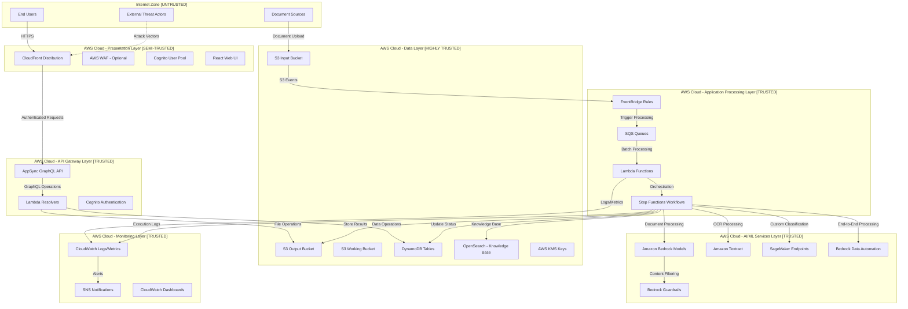
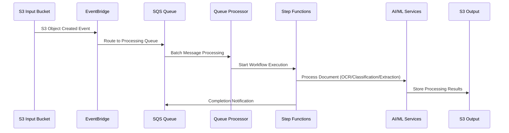

# GenAI IDP Accelerator - System Architecture Overview

## Executive Summary
The GenAI IDP Accelerator is a sophisticated serverless document processing platform that combines multiple AWS services to provide intelligent document processing capabilities. The system operates across multiple security zones with complex data flows and AI/ML integrations, presenting a rich attack surface that requires comprehensive threat analysis.

## High-Level Architecture

### Security Zones & Trust Boundaries



## Core Components Analysis

### 1. Presentation Layer Components

#### CloudFront Distribution
- **Purpose**: Global content delivery for React web UI
- **Security Features**: HTTPS enforcement, custom security headers
- **Trust Level**: Semi-trusted (exposed to internet)
- **Key Vulnerabilities**: Cache poisoning, origin exposure, header bypass

#### AWS WAF (Optional)
- **Purpose**: Web application firewall protection
- **Security Features**: Request filtering, rate limiting, geo-blocking
- **Trust Level**: Security control (when deployed)
- **Key Vulnerabilities**: Rule bypass, false positives, configuration errors

#### Cognito User Pool
- **Purpose**: User authentication and authorization
- **Security Features**: Password policies, MFA, JWT tokens
- **Trust Level**: Trusted authentication boundary
- **Key Vulnerabilities**: Token manipulation, password attacks, account enumeration

### 2. API Layer Components

#### AppSync GraphQL API
- **Purpose**: Backend API for web UI interactions
- **Security Features**: Cognito integration, field-level authorization
- **Trust Level**: Trusted (authenticated access)
- **Key Vulnerabilities**: Query complexity attacks, schema introspection, injection

#### Lambda Resolvers
- **Purpose**: Backend business logic for API operations
- **Security Features**: IAM role isolation, VPC isolation (optional)
- **Trust Level**: Trusted
- **Key Vulnerabilities**: Code injection, privilege escalation, resource exhaustion

### 3. Processing Layer Components

#### Event-Driven Processing Flow


#### Key Processing Components:
- **EventBridge**: Event routing and filtering
- **SQS Queues**: Message buffering and throttling control
- **Lambda Functions**: Stateless processing units
- **Step Functions**: Workflow orchestration with error handling

### 4. AI/ML Services Layer

#### Amazon Bedrock
- **Models Used**: Claude, Nova, custom fine-tuned models
- **Operations**: Text classification, data extraction, summarization
- **Security**: Guardrails integration, content filtering
- **Threats**: Prompt injection, model evasion, token exhaustion

#### Amazon Textract
- **Operations**: OCR processing, form extraction, table detection
- **Input Sources**: PDF, PNG, JPG documents from S3
- **Threats**: Malicious document processing, OCR evasion

#### SageMaker Endpoints (Pattern 3)
- **Models**: UDOP for document classification
- **Deployment**: Real-time inference endpoints
- **Threats**: Model poisoning, endpoint exploitation, resource exhaustion

#### Bedrock Data Automation (Pattern 1)
- **Capabilities**: End-to-end document processing workflows
- **Integration**: S3 input/output, custom processing logic
- **Threats**: Workflow manipulation, quota exhaustion, data leakage

### 5. Data Layer Components

#### S3 Buckets
- **Input Bucket**: Receives uploaded documents
- **Output Bucket**: Stores processing results and UI assets
- **Working Bucket**: Temporary processing artifacts
- **Security**: Encryption at rest, access logging, bucket policies
- **Threats**: Unauthorized access, data exfiltration, bucket enumeration

#### DynamoDB Tables
- **Execution Tracking**: Document processing status
- **Configuration**: System and user configurations
- **Concurrency Control**: Workflow throttling management
- **Security**: Encryption at rest, fine-grained access control
- **Threats**: Injection attacks, unauthorized data access, performance attacks

#### OpenSearch (Knowledge Base)
- **Purpose**: Document semantic search and querying
- **Integration**: Bedrock Knowledge Base service
- **Security**: VPC isolation, encryption, access control
- **Threats**: Search injection, data exposure, performance attacks

## Data Classification & Sensitivity

### High Sensitivity Data
- **Customer Documents**: Input documents may contain PII, financial data, medical records
- **Extracted Data**: Structured data extracted from documents
- **User Credentials**: Authentication tokens, session data
- **AI Model Prompts**: Proprietary processing logic and prompts

### Medium Sensitivity Data
- **Processing Metadata**: Document processing statistics and logs
- **Configuration Data**: System settings, processing parameters
- **Performance Metrics**: System utilization and performance data

### Low Sensitivity Data
- **Public UI Assets**: Static web content, CSS, JavaScript
- **System Status**: General health and availability information
- **Documentation**: User guides and help content

## Network Architecture & Data Flows

### Primary Data Flows

1. **Document Upload Flow**
   ```
   User → CloudFront → S3 Input Bucket → EventBridge → SQS → Processing
   ```

2. **Authentication Flow**
   ```
   User → CloudFront → Cognito → AppSync → Lambda Resolvers → Backend Systems
   ```

3. **Processing Flow (Pattern 2 Example)**
   ```
   S3 Input → Textract (OCR) → Bedrock (Classification) → Bedrock (Extraction) → S3 Output
   ```

4. **Monitoring Flow**
   ```
   All Services → CloudWatch → SNS → Admin Notifications
   ```

### Trust Boundaries

1. **Internet ↔ AWS Cloud**: Primary security perimeter
2. **Presentation ↔ API Layer**: Authentication boundary
3. **API ↔ Processing Layer**: Authorization boundary  
4. **Processing ↔ Data Layer**: Data access boundary
5. **AI/ML Services**: Model security boundary

## Deployment Patterns

### Single-Region Deployment
- All components deployed in single AWS region
- Lower complexity, reduced cross-region data transfer costs
- Limited disaster recovery capabilities

### Multi-Region Considerations
- Cross-region replication for critical data
- Regional AI/ML service availability variations
- Compliance and data residency requirements

## Security Architecture Principles

### Defense in Depth
- Multiple security layers with independent failure modes
- Redundant security controls at each trust boundary
- Comprehensive monitoring and logging

### Least Privilege Access
- IAM roles with minimal required permissions
- Service-to-service authentication via IAM
- Regular access review and rotation

### Zero Trust Networking
- No implicit trust between components
- All communications encrypted in transit
- Continuous verification of access requests

## Key Security Considerations

### High-Risk Areas
1. **Document Upload Interface**: Direct exposure to potentially malicious content
2. **AI/ML Model Interactions**: Prompt injection and model manipulation risks
3. **API Endpoints**: GraphQL complexity and injection attacks
4. **Data Storage**: Unauthorized access to sensitive documents and extracted data
5. **Cross-Service Communication**: Privilege escalation and lateral movement

### Compliance Requirements
- **GDPR**: Personal data protection and privacy rights
- **HIPAA**: Healthcare information security (if processing medical documents)
- **SOX**: Financial data integrity and audit trails
- **PCI-DSS**: Payment card data security (if processing financial documents)

## Architecture Security Assessment

### Strengths
- Comprehensive IAM role separation
- Encryption at rest and in transit
- Serverless architecture with automatic scaling
- Integrated monitoring and logging
- AI/ML guardrails for content safety

### Potential Weaknesses
- Complex attack surface with many integration points
- Dependency on cloud provider security controls
- Limited visibility into AI/ML model internal processing
- Potential for configuration drift and misalignment
- Cross-service communication complexity

This architecture overview provides the foundation for detailed threat modeling across all system components and data flows.
